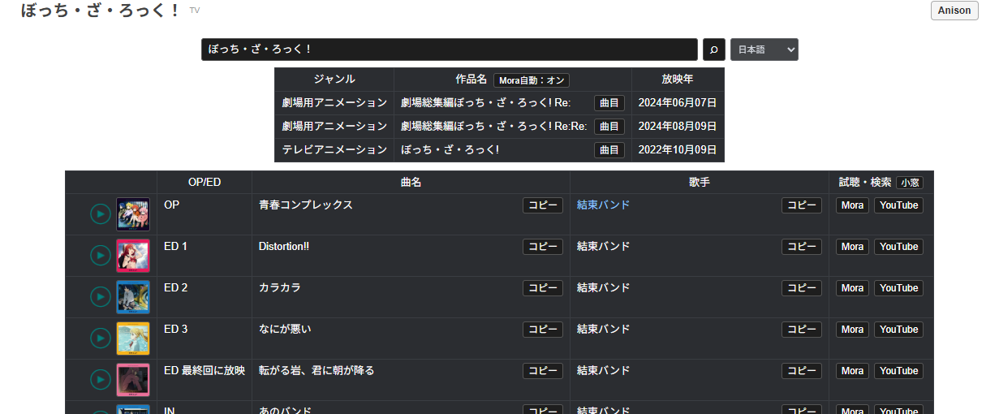

# Bangumi Anison Helper

[日本語](README.md) | [English](README.en.md)

Bangumi・Annict の作品ページから、アニメの OP・ED 情報をすぐに確認できるユーザースクリプトです。曲名と歌手名をコピーし、Mora の試聴・商品ページや YouTube の検索結果へ移動できます。



## インストール

1. [Tampermonkey](https://www.tampermonkey.net/) などのユーザースクリプトマネージャーをブラウザに追加します。
2. [Greasy Fork から Bangumi Anison Helper をインストール](https://greasyfork.org/scripts/588327-bangumi-anison-helper) を開き、「スクリプトをインストール」を選びます。
3. Bangumi または Annict の対応ページを開きます。

対応ページ:

- Bangumi の作品ページ
- Bangumi のアニメ一覧ページ
- Annict の作品ページ・作品一覧ページ

## 主な機能

- 作品タイトルから [Anison Generation](https://anison.info/) の主題歌データを検索
- OP・ED、曲名、歌手名を見やすい表で表示
- 曲名・歌手名をワンクリックでコピー
- Mora の候補を表内に表示し、試聴ページまたは商品ページを開く
- 曲名と歌手名で YouTube を検索
- 操作表示を日本語・英語から選択（初期設定は日本語）
- 表記揺れ、シーズン表記、記号を考慮した複数の検索候補
- Bangumi と Annict の一覧ページから作品ごとに検索

## 使い方

作品ページではタイトル付近の「Anison」、一覧ページでは作品ごとの「A」を押すと、主題歌一覧が開きます。各曲の行から Mora と YouTube を利用でき、列の内容はクリックでコピーできます。

Mora の自動検索は表のヘッダーでオン・オフを切り替えられます。リンクを再利用する小さなウィンドウで開くか、新しいタブで開くかも選択できます。

操作表示は日本語が初期設定です。検索欄の右側にある小さな言語メニューから English に切り替えられ、選択内容はブラウザに保存されます。切り替わるのは本スクリプトのボタン、状態表示、補助メッセージです。取得した作品名・曲名・歌手名は元の表記を保ちます。

## 設計上のポイント

作品名はサイトごとに表記が異なり、シーズン番号、記号、サブタイトルによって検索に失敗することがあります。このスクリプトは元のタイトルを優先しながら候補を段階的に広げ、取得した結果が対象作品と関連しているかを確認してから表示します。

Mora 検索では曲名と歌手名を基本にし、キャラクター名と声優名が併記されている場合は声優名も検索候補として利用します。外部サイトで候補が見つからない場合は、通常の検索ページへ移動できます。

## プライバシー

このスクリプトは利用状況や個人情報を収集しません。作品・楽曲の検索時に Anison Generation と Mora へリクエストを送ります。表示言語を含む表示設定はブラウザの `localStorage` に保存されます。

## 制限事項

- 外部サイトのデータやページ構造が変わると、検索や試聴が動作しない場合があります。
- 楽曲情報の正確性と網羅性は外部データソースに依存します。
- Mora の配信・試聴可否は作品や地域によって異なります。
## 開発

Node.js で構文チェックとテストを実行できます。追加パッケージは不要です。

```bash
npm test
```

## License

[MIT License](LICENSE)
